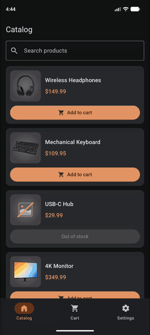
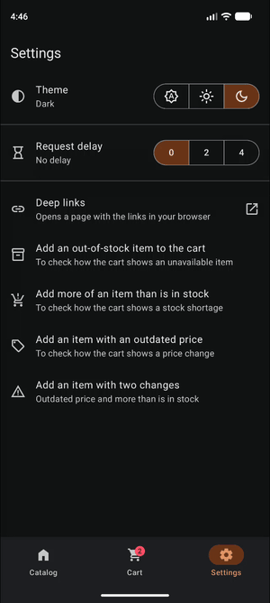
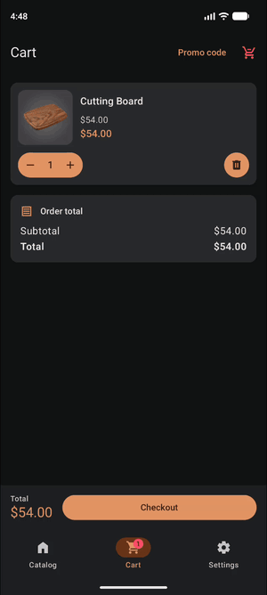
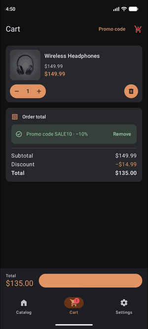

# ShoppingApp

[](https://github.com/dmitriiecho/ShoppingApp/actions/workflows/ci.yml)

[Русская версия](README.ru.md)

ShoppingApp is a demo shop for Android: a catalog with search, a cart checked by the server, promo codes and checkout. An example of an app built on a current stack, where the module architecture, navigation, screen state and data handling are all thought through.

&nbsp;

## Variants

The same app is built on three slightly different stacks, each variant in its own branch:

| Branch | Stack | Download |
|---|---|---|
| [`main`](https://github.com/dmitriiecho/ShoppingApp/tree/main) | Android: Hilt, Retrofit + OkHttp, Room, Navigation Compose | [APK](https://github.com/dmitriiecho/ShoppingApp/releases/download/main-latest/ShoppingApp.apk) |
| `kmp-ready` | Android, with libraries replaced by ones that work in Kotlin Multiplatform | coming |
| `kmp` | Kotlin Multiplatform | coming |

&nbsp;

## How it looks

The four main flows, as they run in the app:

| Catalog | Cart | Promo code | Checkout |
|:---:|:---:|:---:|:---:|
|  |  |  |  |
| search, and the image flies into the product | the server found changes: remove and accept | a code from the hint, the discount in the totals | address, payment and the order |

&nbsp;

## What's inside

The app is small, but every screen has something to look at:

- **Catalog**: search that waits for a pause in typing, pages loaded from the server, the product image flying into its details.
- **Cart**, kept on the device and checked by the server each time it opens and before checkout: items gone, new prices, not enough stock.
- **Promo codes** checked by the server, with the discount right in the totals.
- **Checkout**: the form survives process death, and a double tap won't place the order twice.
- **Deep links** to the catalog, the cart and a product, with verified App Links.
- **Settings**: the theme, a request delay and test items that put each possible change into the cart.
- **UI kit**: a separate app with every styled component.

&nbsp;

## Architecture

Modules are laid out in four levels, and the build checks that no module depends on a level above its own:

```text
apps/     shop, uikit                                    the applications
feature/  catalog, cart, promo, checkout, settings       each one is ui + impl
shared/   domain, data, ui, analytics                    shop code used by two or more features
core/     designsystem, compose-utils, network, config   knows nothing about the shop
```

How the modules, navigation, screens, data, analytics and the build work is in the [architecture docs](docs/architecture/en/README.md).

&nbsp;

## Running

The easiest way is to download the [APK from `main`](https://github.com/dmitriiecho/ShoppingApp/releases/download/main-latest/ShoppingApp.apk): a release build for Android 8.0 and newer, rebuilt by CI after every code change in `main`.

To build it yourself you need JDK 21 and the Android SDK:

```sh
./gradlew :apps:shop:installDebug      # the shop on a connected device
./gradlew :apps:uikit:installDebug     # the UI kit app
```

&nbsp;

## Server

The catalog, promo codes and cart checks come from a small Ktor server in [`server/`](server/README.md). It is deployed at `http://2.56.204.151:8080/`, and both debug and release builds talk to it.

&nbsp;

## Built with AI agents

The app is developed with the AI agents Claude Code, Cursor and Grok Build, on Claude Opus and Grok models. Agents speed the work up a lot, but they don't write good code by themselves: they need rules, step-by-step guidance and checks of what they produce. In this project that works like this:

- **The rules are written down for the agents**: [CLAUDE.md](CLAUDE.md) describes the module layout, the code style and the conventions for screens.
- **Changes go in small steps**, each discussed and checked before it is committed.
- **Behaviour is checked by tests** on the JVM: the logic, the ViewModels, the data layer, the contract with the server and a screenshot of every preview. CI runs them along with the style, the module rules, unused dependencies, lint and the build. Changes are also tried on an emulator.
