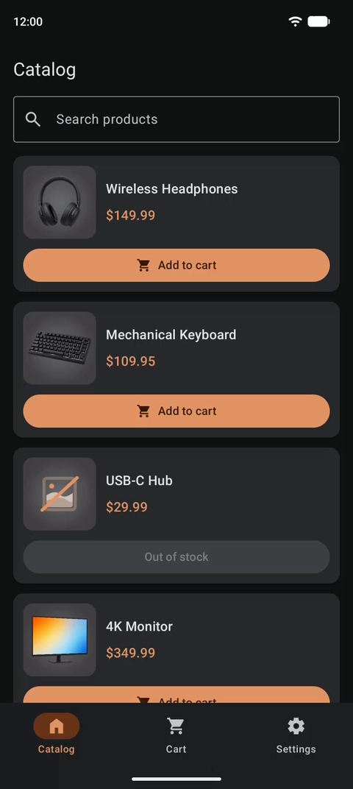
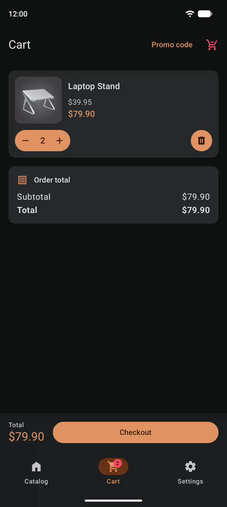
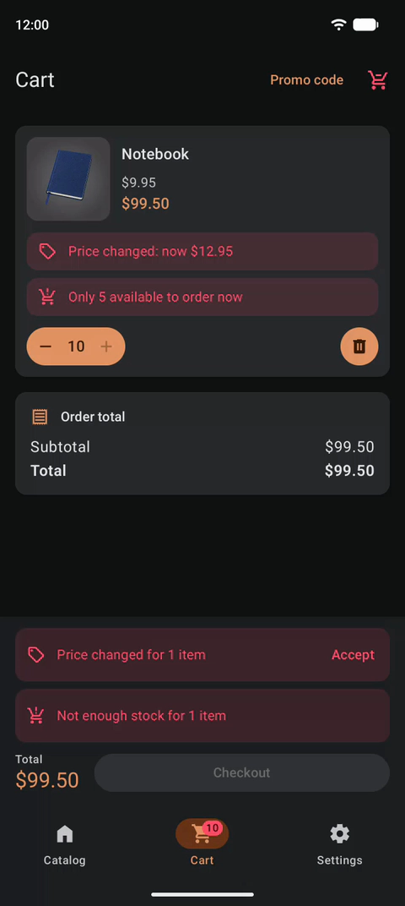

# ShoppingApp

[](https://github.com/dmitriiecho/ShoppingApp/actions/workflows/ci.yml)

[English version](README.md)

ShoppingApp — пример Android-приложения на актуальном стеке. В репозитории два приложения:

- **Магазин** — демо-магазин: каталог с поиском, корзина, которая хранится на устройстве и сверяется с сервером, промокоды и оформление заказа. Работает на телефонах и планшетах.
- **UI kit** — витрина дизайна: все стилизованные компоненты магазина по разделам, со сменой светлой и тёмной темы. Нужен, чтобы смотреть и проверять дизайн, не проходя сценарии магазина.

&nbsp;

## Варианты

Одно и то же приложение собрано на трёх немного разных стеках, каждый вариант — в своей ветке:

| Ветка | Стек | Скачать |
|---|---|---|
| [`main`](https://github.com/dmitriiecho/ShoppingApp/tree/main) | Android: Hilt, Retrofit + OkHttp, Room, Navigation Compose | [APK](https://github.com/dmitriiecho/ShoppingApp/releases/download/main-latest/ShoppingApp.apk), [APK UI kit](https://github.com/dmitriiecho/ShoppingApp/releases/download/main-latest/ShoppingApp-UiKit.apk) |
| `kmp-ready` | Android, библиотеки заменены на те, что работают в Kotlin Multiplatform | скоро |
| `kmp` | Kotlin Multiplatform | скоро |

У каждой ветки два APK: магазин и UI kit.

&nbsp;

## Как это выглядит

Три основных сценария, как они работают в приложении, слева направо: каталог, корзина и промокод, изменения на сервере и оформление.

<p>
  
  
  
</p>

&nbsp;

## Что внутри

Приложение небольшое, но в каждом экране есть что посмотреть:

- **Каталог**: поиск с паузой при наборе, постраничная загрузка с сервера, картинка товара перелетает в карточку.
- **Корзина** хранится только на устройстве (Room): у сервера корзин нет, он лишь сверяет эту при каждом открытии корзины и перед оформлением: пропавшие товары, новые цены, нехватка на складе.
- **Промокоды** проверяет сервер, скидка сразу видна в итогах.
- **Оформление заказа**: форма переживает смерть процесса, двойной тап не отправит заказ дважды.
- **Deep links** на каталог, корзину и товар, с проверкой App Links.
- **Настройки**: тема, задержка запросов и тестовые товары, которые кладут в корзину каждое из возможных изменений.
- **Планшеты и широкие экраны**: содержимое держится колонкой посередине, а карточка товара в горизонтальном положении ставит картинку и описание рядом ([подробнее](docs/architecture/ru/screens.md#широкие-экраны)).

&nbsp;

## Архитектура

Модули разложены по четырём уровням, и сборка проверяет, что ни один модуль не зависит от уровня выше своего:

```text
apps/     shop, uikit                                    приложения
feature/  catalog, cart, promo, checkout, settings       каждая фича — это ui + impl
shared/   domain, data, ui, analytics                    код магазина, нужный двум фичам и больше
core/     designsystem, compose-utils, network, config   ничего не знает о магазине
```

Как устроены модули, навигация, экраны, данные, аналитика и сборка, рассказано в [документации по архитектуре](docs/architecture/ru/README.md).

&nbsp;

## Тесты и CI

- **Тесты** на JVM: логика, ViewModel, слой данных, контракт с сервером и скриншот каждого превью.
- **CI** на каждый pull request: стиль кода, правила модулей, неиспользуемые зависимости, lint, тесты и сборка обоих приложений. Изменившиеся скриншоты он показывает в комментарии к pull request, а после каждого изменения в `main` пересобирает APK.

&nbsp;

## Запуск

Проще всего скачать [APK из ветки `main`](https://github.com/dmitriiecho/ShoppingApp/releases/download/main-latest/ShoppingApp.apk): это release-сборка, она ставится на Android 8.0 и новее. Её пересобирает CI после каждого изменения кода в `main`. Там же лежит приложение UI kit со всеми стилизованными компонентами: [APK UI kit](https://github.com/dmitriiecho/ShoppingApp/releases/download/main-latest/ShoppingApp-UiKit.apk).

Чтобы собрать самому, нужны JDK 21 и Android SDK:

```sh
./gradlew :apps:shop:installDebug      # магазин на подключённое устройство
./gradlew :apps:uikit:installDebug     # приложение UI kit
```

&nbsp;

## Сервер

Каталог, промокоды и проверку корзины отдаёт небольшой сервер на Ktor из папки [`server/`](server/README.ru.md). Он развёрнут по адресу `http://2.56.204.151:8080/`, и приложение обращается к нему и в debug, и в release.

&nbsp;

## Сделано вместе с ИИ

Приложение разработано с ИИ-агентами Claude Code, Cursor и Grok Build на моделях Claude Opus и Grok. Агенты сильно ускоряют работу, но хороший код сами по себе не пишут: им нужно задавать правила, вести по шагам и проверять результат. В этом проекте это устроено так:

- **Правила записаны для агентов**: [CLAUDE.md](CLAUDE.md) описывает устройство модулей, стиль кода и договорённости по экранам.
- **Изменения делаются небольшими шагами**, и каждый обсуждается и проверяется до коммита.
- **Поведение проверяют тесты и CI** (см. [выше](#тесты-и-ci)), а изменения ещё и пробуются на эмуляторе.
