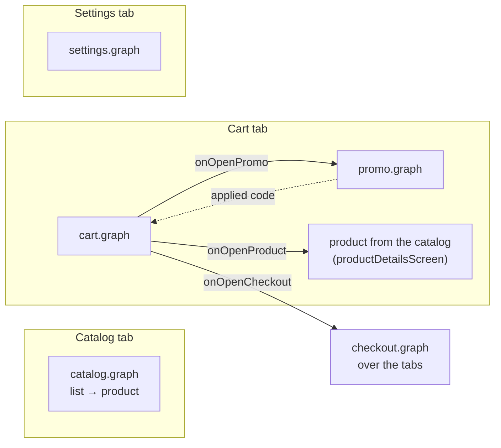
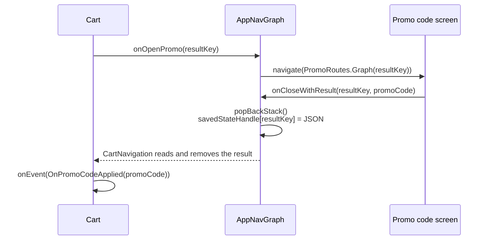
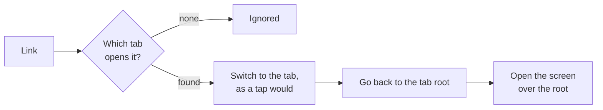

# Navigation

[Русская версия](../ru/navigation.md) · [All pages](README.md)

Navigation Compose with type-safe routes (`@Serializable` objects and classes). Features don't know each other: each one gives the app a graph, and the app joins the graphs.

## How the features are joined



Every arrow is a callback that [`AppNavGraph.kt`](../../../apps/shop/src/main/java/krio/systemdesign/shoppingapp/navigation/AppNavGraph.kt) passes to the feature graphs. The cart knows neither the promo code screen nor the checkout: it just calls `onOpenPromo(…)` and `onOpenCheckout()`.

```kotlin
cart.cartGraph(
    navController = navController,
    onClose = {}, // Tab root: nothing to close.
    onOpenCheckout = { navController.navigate(CheckoutRoutes.Graph) },
    onOpenPromo = { resultKey -> navController.navigate(PromoRoutes.Graph(resultKey = resultKey)) },
    // ...
)
```

> [!TIP]
> App-wide navigation behaviour — what Back does on a tab, how tabs stack — is changed in `AppNavGraph` and the bottom bar, not in the features.

## A feature's graph

Every feature has the same shape, even one with a single screen:

```kotlin
object CartRoutes {
    @Serializable data object Graph            // public: the app opens the feature with it
    @Serializable internal data object Cart    // the feature's own screens
}

fun CartNavigationScope.graph(
    navController: NavController,
    onClose: () -> Unit,                       // leave the whole feature
    onOpenCheckout: () -> Unit,                // a way out to another feature
    // ...
)
```

> [!IMPORTANT]
> **`onClose` means "leave the feature", and the host decides what that is.** A tab root has nowhere to go, so the app passes `{}`; the same feature inside a flow would close the flow.

`graph(navController, onClose, …)` is the same everywhere, even where `navController` isn't used yet: a feature can grow screens without changing its signature.

## Tabs

- **Switching a tab pops everything, the catalog too** ([`BottomTabs.kt`](../../../apps/shop/src/main/java/krio/systemdesign/shoppingapp/navigation/bottombar/BottomTabs.kt)), with `saveState`/`restoreState` so each tab keeps its own stack. Back from any tab root leaves the app instead of going to the catalog.
- **The bottom bar is shown only inside tabs**: the checkout covers it.
- **A product image flies between screens within a tab** (shared element), but not between tabs: while tabs switch, the shared transition scope is `null`.

<p align="center">
  
</p>

## Product details inside the cart tab

Product details belong to the catalog, but a product opened from the cart must stay in the cart tab. The catalog offers:

| What | Why |
|---|---|
| `ProductDetailsRoute` | an interface with the screen's arguments: `productId`, `productName`, `imageUrl` |
| `productDetailsScreen<T>()` | adds the screen under any route that implements it |

```kotlin
// In the app:
@Serializable
data class CartProductRoute(
    override val productId: String,
    override val productName: String? = null,
    override val imageUrl: String? = null,
) : ProductDetailsRoute

catalog.productDetailsScreen<CartProductRoute>(onBack = { navController.popBackStack() })
```

The ViewModel reads the arguments by the interface's property names, so it works with either route.

<p align="center">
  
</p>

## Screen results

The promo code screen returns the applied code to the cart:



- **`resultKey` works like a request code**: one promo graph can serve several callers, each gets the result under its own key.
- **The result goes into the `savedStateHandle` of the caller's back stack entry**, as JSON of `PromoCode`.

> [!WARNING]
> The result can't go straight into the ViewModel's `SavedStateHandle`: an entry's handle and a ViewModel's handle are separate objects, and the ViewModel would never see it. So navigation reads the result and passes it to the ViewModel as an event.

## Navigation goes through the ViewModel

Every button that navigates, Back and Close included, sends an event; the ViewModel answers with an effect, and the screen navigates inside `navigate { }` (see [Screens](screens.md#effects)).

```kotlin
// ❌ The screen navigates by itself: a double tap opens the screen twice
NavigateBackIconButton(onClick = onBack)

// ✅ Event → effect → navigate { }
NavigateBackIconButton(onClick = { onEvent(ProductDetailsEvent.OnBackClick) })
// in the ViewModel:  OnBackClick -> send(ProductDetailsEffect.NavigateBack)
// in the screen:     ProductDetailsEffect.NavigateBack -> navigate { onBack() }
```

<details>
<summary>How a fast double tap is stopped</summary>

- **`navigate { }` runs only while the screen is on top** (`RESUMED`). After the first navigation the screen is no longer on top, so the second one waits and is dropped when the screen stops.
- **A screen that is leaving doesn't take taps** ([`BlockTouchesDuringTransitions.kt`](../../../apps/shop/src/main/java/krio/systemdesign/shoppingapp/navigation/transitions/BlockTouchesDuringTransitions.kt)). During the transition the old screen is still visible and used to catch the second tap: a double tap on Back closed two screens.

</details>

## Deep links

| Link | Opens |
|---|---|
| `https://dmitriiecho.github.io/ShoppingApp/catalog` | the catalog tab |
| `https://dmitriiecho.github.io/ShoppingApp/cart` | the cart tab |
| `https://dmitriiecho.github.io/ShoppingApp/product/{id}` | a product over the catalog |



So Back from a product opened by a link goes to the catalog, as if the user had got there by themselves ([`DeepLinks.kt`](../../../apps/shop/src/main/java/krio/systemdesign/shoppingapp/navigation/DeepLinks.kt)).

- **App Links are verified**: the debug key is kept in the repo, and its fingerprint is in `assetlinks.json` on the domain, so a build from any computer opens the links.
- **The domain and paths are written twice**, in the manifest's intent filter and in `DeepLinkConfig`; a comment in each points to the other.
- **Test pages** with every link, with a trailing slash and edge cases (an unknown product, an unknown path) are in [`docs/deeplinks/`](../../deeplinks/) and published on GitHub Pages; the settings screen opens them.

<details>
<summary>Why the launch link is opened only once</summary>

`MainActivity` opens the link the app was launched with, then clears it from the intent: otherwise `NavHost` would open it again by itself, with a different back stack. The link isn't opened again after recreation (the restored screens already show it) or from Recents, which relaunches the app with the old intent.

</details>
