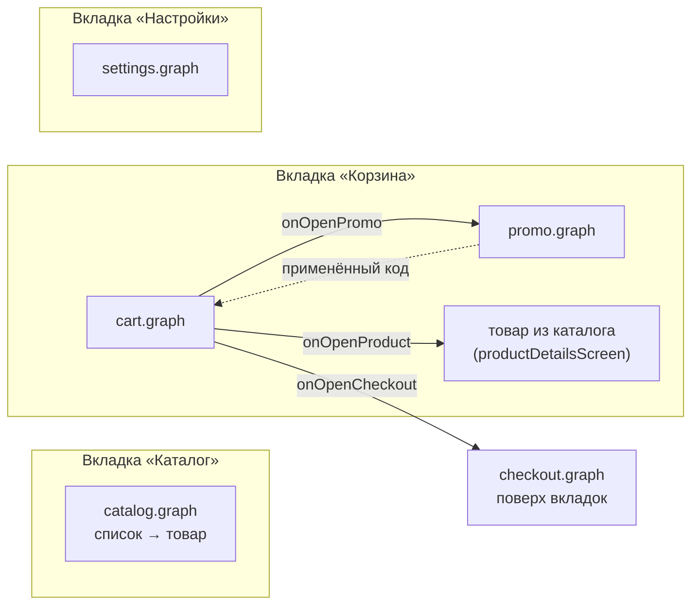
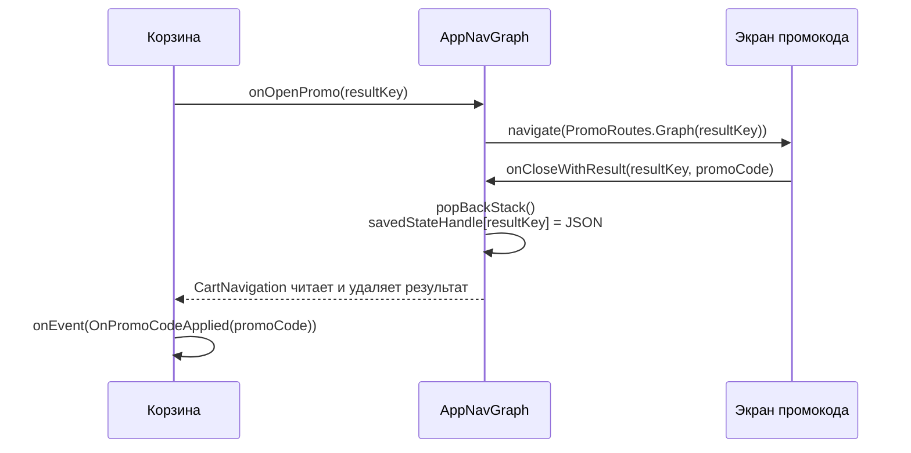
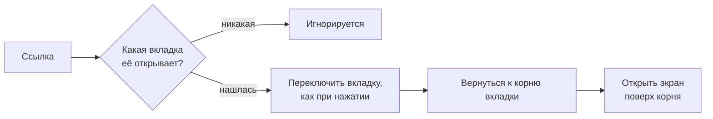

# Навигация

[English version](../en/navigation.md) · [Все разделы](README.md)

Navigation Compose с типизированными маршрутами (`@Serializable`-объекты и классы). Фичи не знают друг о друге: каждая отдаёт приложению свой граф, а приложение соединяет графы.

## Как фичи соединены



Все стрелки — это колбэки, которые [`AppNavGraph.kt`](../../../apps/shop/src/main/java/krio/systemdesign/shoppingapp/navigation/AppNavGraph.kt) передаёт в графы фич. Корзина не знает ни экрана промокода, ни оформления: она просто вызывает `onOpenPromo(…)` и `onOpenCheckout()`.

```kotlin
cart.cartGraph(
    navController = navController,
    onClose = {}, // Tab root: nothing to close.
    onOpenCheckout = { navController.navigate(CheckoutRoutes.Graph) },
    onOpenPromo = { resultKey -> navController.navigate(PromoRoutes.Graph(resultKey = resultKey)) },
    // ...
)
```

> [!TIP]
> Поведение навигации во всём приложении — что делает «Назад» на вкладке, как вкладки ложатся друг на друга — меняется в `AppNavGraph` и нижней панели, а не в фичах.

## Граф фичи

У всех фич одинаковое устройство, даже у фичи с одним экраном:

```kotlin
object CartRoutes {
    @Serializable data object Graph            // публичный: по нему приложение открывает фичу
    @Serializable internal data object Cart    // собственные экраны фичи
}

fun CartNavigationScope.graph(
    navController: NavController,
    onClose: () -> Unit,                       // выйти из фичи целиком
    onOpenCheckout: () -> Unit,                // выход в другую фичу
    // ...
)
```

> [!IMPORTANT]
> **`onClose` значит «выйти из фичи», а что это значит конкретно, решает тот, кто фичу встроил.** У корня вкладки выходить некуда, поэтому приложение передаёт `{}`; та же фича внутри сценария закрыла бы этот сценарий.

`graph(navController, onClose, …)` везде одинаковая, даже там, где `navController` пока не нужен: фича может обрасти экранами, не меняя сигнатуры.

## Вкладки

- **Переключение вкладки снимает со стека всё, в том числе каталог** ([`BottomTabs.kt`](../../../apps/shop/src/main/java/krio/systemdesign/shoppingapp/navigation/bottombar/BottomTabs.kt)), с `saveState`/`restoreState`, так что у каждой вкладки свой стек. «Назад» с корня любой вкладки выходит из приложения, а не возвращает в каталог.
- **Нижняя панель видна только внутри вкладок**: оформление заказа её закрывает.
- **Картинка товара перелетает между экранами внутри вкладки** (shared element), но не между вкладками: пока вкладки переключаются, scope общих переходов равен `null`.

<p align="center">
  
</p>

## Карточка товара во вкладке корзины

Карточка товара принадлежит каталогу, но товар, открытый из корзины, должен остаться во вкладке корзины. Каталог для этого предлагает:

| Что | Зачем |
|---|---|
| `ProductDetailsRoute` | интерфейс с аргументами экрана: `productId`, `productName`, `imageUrl` |
| `productDetailsScreen<T>()` | добавляет экран под любой маршрут, который этот интерфейс реализует |

```kotlin
// В приложении:
@Serializable
data class CartProductRoute(
    override val productId: String,
    override val productName: String? = null,
    override val imageUrl: String? = null,
) : ProductDetailsRoute

catalog.productDetailsScreen<CartProductRoute>(onBack = { navController.popBackStack() })
```

ViewModel читает аргументы по именам свойств интерфейса, поэтому работает с любым из двух маршрутов.

<p align="center">
  
</p>

## Результат экрана

Экран промокода возвращает корзине применённый код:



- **`resultKey` — как request code**: один граф промокода может обслуживать несколько вызывающих, каждый получает результат под своим ключом.
- **Результат кладётся в `savedStateHandle` записи стека** вызывающего экрана, в виде JSON с `PromoCode`.

> [!WARNING]
> Положить результат прямо в `SavedStateHandle` ViewModel'и нельзя: у записи стека и у ViewModel'и это разные объекты, и ViewModel его не увидит. Поэтому результат читает навигация и передаёт во ViewModel событием.

## Навигация идёт через ViewModel

Каждая кнопка, которая куда-то ведёт, включая «Назад» и «Закрыть», отправляет событие; ViewModel отвечает эффектом, а экран переходит внутри `navigate { }` (см. [Экраны](screens.md#эффекты)).

```kotlin
// ❌ Экран переходит сам: двойной тап откроет экран дважды
NavigateBackIconButton(onClick = onBack)

// ✅ Событие → эффект → navigate { }
NavigateBackIconButton(onClick = { onEvent(ProductDetailsEvent.OnBackClick) })
// во ViewModel:  OnBackClick -> send(ProductDetailsEffect.NavigateBack)
// на экране:     ProductDetailsEffect.NavigateBack -> navigate { onBack() }
```

<details>
<summary>Как остановлен быстрый двойной тап</summary>

- **`navigate { }` выполняется, только пока экран сверху** (`RESUMED`). После первого перехода экран уже не сверху, поэтому второй переход ждёт и отбрасывается, когда экран останавливается.
- **Уходящий экран не принимает нажатия** ([`BlockTouchesDuringTransitions.kt`](../../../apps/shop/src/main/java/krio/systemdesign/shoppingapp/navigation/transitions/BlockTouchesDuringTransitions.kt)). Пока идёт анимация перехода, старый экран ещё виден и раньше ловил второй тап: двойной тап по «Назад» закрывал два экрана.

</details>

## Deep links

| Ссылка | Что открывает |
|---|---|
| `https://dmitriiecho.github.io/ShoppingApp/catalog` | вкладку каталога |
| `https://dmitriiecho.github.io/ShoppingApp/cart` | вкладку корзины |
| `https://dmitriiecho.github.io/ShoppingApp/product/{id}` | товар поверх каталога |



Так «Назад» с товара из ссылки ведёт в каталог, как если бы пользователь пришёл туда сам ([`DeepLinks.kt`](../../../apps/shop/src/main/java/krio/systemdesign/shoppingapp/navigation/DeepLinks.kt)).

- **App Links проверены**: debug-ключ лежит в репозитории, а его отпечаток есть в `assetlinks.json` на домене, поэтому ссылки открывает сборка с любого компьютера.
- **Домен и пути записаны дважды**, в intent-filter манифеста и в `DeepLinkConfig`; комментарий в каждом месте указывает на другое.
- **Тестовые страницы** со всеми ссылками, с завершающим слешем и краевыми случаями (несуществующий товар, неизвестный путь) лежат в [`docs/deeplinks/`](../../deeplinks/) и опубликованы на GitHub Pages; их открывает экран настроек.

<details>
<summary>Почему ссылка запуска открывается только один раз</summary>

`MainActivity` открывает ссылку, с которой приложение запустили, а затем стирает её из intent. Иначе `NavHost` открыл бы её ещё раз сам, с другим стеком. Ссылка не открывается повторно ни после пересоздания экрана (сохранённые экраны и так её показывают), ни при запуске из списка недавних: оттуда Android перезапускает приложение со старым intent.

</details>
