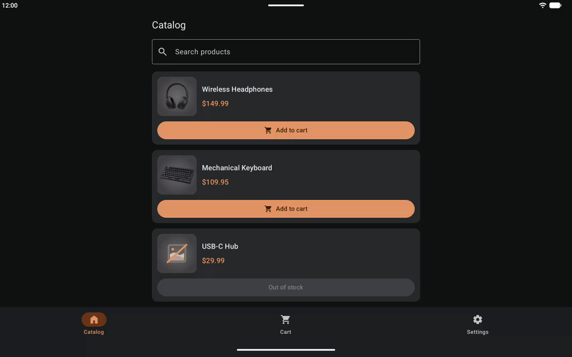

# Экраны

[English version](../en/screens.md) · [Все разделы](README.md)

У каждого экрана одно состояние UI, набор событий от пользователя и набор разовых эффектов. ViewModel превращает события в новое состояние или в эффект, а экран только рисует состояние и реагирует на эффекты.

&nbsp;

## Из каких файлов состоит экран

Все экраны устроены одинаково. Возьмём для примера корзину (`feature/cart/impl/.../presentation/cart/`):

| Файл | Что в нём |
|---|---|
| `CartScreen.kt` | две перегрузки `CartScreen`, приватный `CartContent` и мелкие помощники вроде верхней панели |
| `CartViewModel.kt` | состояние, обработка событий, эффекты |
| `CartUiState.kt` | состояние и его вложенные типы |
| `CartEvent.kt`, `CartEffect.kt` | что делает пользователь и что должно произойти один раз |
| `components/` | секции со своими превью: `CartItemCard`, `CartTotalsCard`, … |

&nbsp;

## Две перегрузки экрана

У экрана две функции с одним именем. Первая берёт ViewModel и собирает состояние и эффекты, вторая только рисует:

```kotlin
@Composable
internal fun CartScreen(
    onBack: () -> Unit,
    onOpenCheckout: () -> Unit,
    // ...
    viewModel: CartViewModel = hiltViewModel(),
)

@Composable
internal fun CartScreen(
    uiState: CartUiState,
    snackbarHostState: SnackbarHostState,
    onEvent: (CartEvent) -> Unit,
    modifier: Modifier = Modifier,
)
```

Вторая не зависит от Hilt, поэтому её можно показать в превью в любом состоянии.

`onEvent` не выходит за пределы этого файла: его получают только сам экран, `CartContent` и мелкие приватные помощники. Секции из `components/` получают конкретные колбэки, поэтому ничего не знают о событиях экрана, и их можно показать в превью отдельно:

```kotlin
CartItemCard(
    item = item,
    onQuantityChange = { productId, quantity -> onEvent(CartEvent.OnQuantityChange(productId, quantity)) },
    onRemove = { onEvent(CartEvent.OnRemoveFromCartClick(it)) },
    // ...
)
```

&nbsp;

## UI state

Состояние — это один `StateFlow` на экран, собранный через `combine` из источников и `stateIn`. Типы, которые нужны только внутри состояния, вложены в него:

```kotlin
data class CartUiState(
    val content: Content = Content.Loading,
    val isOpeningCheckout: Boolean = false,
    val isClearCartDialogVisible: Boolean = false,
) {
    val canCheckout: Boolean
        get() = content is Content.Loaded && content.allowsCheckout && !isOpeningCheckout

    sealed interface Content {
        data object Loading : Content
        data class Loaded(val items: List<Item>, /* ... */) : Content
    }
}
```

- **К вложенным типам обращаются через владельца**, например `CartUiState.Item`, а имя владельца в их названии не повторяется: `PromoCodeUiState.Check`, а не `PromoCodeCheck`.
- **Поля сгруппированы по секциям экрана**, а не идут плоским списком: у оформления заказа это `order`, `address` и `paymentMethod`.
- **Загрузка — это состояние, а не флаг и не `null`**: sealed `Loading` / `Loaded` / `Error`, везде с этими именами. `null` означает только «неизвестно», например имя товара, которое не передала ссылка.
- **Состояние хранит то, что экран рисует.** Если экран показывает доменную модель без изменений, она и попадает в состояние без изменений: товары заказа при оформлении, промокоды в подсказке. Собственную UI-модель из простых значений экран заводит, когда ему нужны заранее принятые решения или [стабильность Compose](#стабильность-compose): `CartUiState.Item` хранит `canAddOneMore` и проблемы товара, поэтому нажатие на «+» перерисовывает только карточку этого товара.
- **Условия, которые нужны в нескольких местах, — это геттеры** состояния, как `canCheckout` выше.

Проверка перед действием читает сам источник, а не `uiState`: в состояние изменение попадает только после `combine`, то есть чуть позже. Раньше из-за этого быстрое двойное нажатие на «Оформить заказ» оформляло заказ дважды:

```kotlin
private fun submitOrder() {
    if (submission.value is Submission.Submitting || !uiState.value.canSubmit) return
    val order = uiState.value.order as? CheckoutUiState.Order.Loaded ?: return
    submission.value = Submission.Submitting(order)
    // ...
}
```

&nbsp;

## Эффекты

Навигация и снекбары должны сработать один раз, поэтому это эффекты, которые передаются через `Channel`, а не часть состояния: в состоянии для них понадобилось бы ещё одно событие «обработано». Экран обрабатывает их через [`ObserveEffects`](../../../core/compose-utils/src/main/java/krio/systemdesign/shoppingapp/core/composeutils/effects/ObserveEffects.kt):

```kotlin
ObserveEffects(viewModel.effects) { effect ->
    when (effect) {
        CartEffect.NavigateToCheckout -> navigate { onOpenCheckout() }
        is CartEffect.ShowSnackBar -> showSnackbar(snackbarHostState, effect.message.asString(resources))
        // ...
    }
}
```

Внутри `ObserveEffects` эффекты собираются, пока экран виден, и обрабатываются сразу, на `Main.immediate`:

```kotlin
lifecycle.repeatOnLifecycle(Lifecycle.State.STARTED) {
    withContext(Dispatchers.Main.immediate) {
        effects.collect { effect -> scope.currentOnEffect(effect) }
    }
}
```

- **Эффект, отправленный, пока приложение в фоне**, ждёт в канале и обрабатывается, когда пользователь вернётся.
- **`Main.immediate`** нужен, чтобы экран обрабатывал эффект прямо внутри `send` во ViewModel: если бы между ними была пауза, экран, остановившийся в этот момент, мог бы забрать эффект и потерять его.
- **`navigate { }` выполняется, только пока экран сверху**, а **`showSnackbar` работает в отдельной корутине**: снекбар ждёт, пока его закроют, и иначе задержал бы следующий эффект.

У экрана один эффект для снекбара, `ShowSnackBar(UiText)`: так ViewModel может собрать текст из строкового ресурса, не имея доступа к ресурсам.

&nbsp;

## Поля ввода

Текст поля — это `TextFieldState`, который создаёт ViewModel и кладёт в состояние; один и тот же объект живёт, пока жив экран. `savedTextField` сохраняет его в `SavedStateHandle`, так что текст переживает смерть процесса:

```kotlin
private val searchQuery: TextFieldState = savedStateHandle.savedTextField(KEY_SEARCH_QUERY)
```

- **События `OnTextChange` нет.** Поле меняет состояние напрямую, поэтому ввод никогда не ждёт flow и не теряет символы.
- **Значения, которые зависят от текста, — это геттеры** состояния, и Compose сам отслеживает их чтение:

  ```kotlin
  val canApply: Boolean
      get() = promoCode.text.isNotBlank() && !isChecking
  ```

- **`snapshotFlow { state.text }` во ViewModel нужен для действий**: например, чтобы запустить поиск или сбросить ошибку, когда пользователь поправил текст.

&nbsp;

## Сохранение состояния

То, что пользователь ввёл или открыл, переживает смерть процесса, а ход запросов — нет:

| Переживает | Как |
|---|---|
| текст в полях | `savedStateHandle.savedTextField(key)` |
| открытый диалог, выбранный вариант | `savedStateHandle.getStateFlow(key, default)` |
| страница каталога, на которой был пользователь | номер страницы в `SavedStateHandle`; список открывается на ней |
| результаты запросов | не хранятся: экран загружает их заново |

&nbsp;

## Стабильность Compose

Strong skipping включён, поэтому по умолчанию ничего не размечается: composable пропускается, если снова получает тот же объект. Исправляется только то, что показали отчёты компилятора и лог перерисовок.

Чтобы объект менялся, только когда меняется его источник, источник преобразуется до `combine`:

```kotlin
val uiState = combine(
    observeCart().map { it.toOrder() },  // новый заказ — только при изменении корзины
    paymentMethod,
    submission,
) { cartOrder, payment, latestSubmission -> CheckoutUiState(/* ... */) }
```

Модели из `:shared:domain` для Compose нестабильны: этот модуль собирается без компилятора Compose, и аннотациям Compose там не место. Это важно для списков, где карточки меняются по одной, как в корзине: там экран получает собственную UI-модель из простых значений, `CartUiState.Item`. Экран, который показывает данные без изменений, как оформление заказа, работает с доменными моделями.

Колбэки списка принимают id элемента, а не захватывают сам элемент. Так все карточки получают одни и те же лямбды, и нажатие на «+» перерисовывает только одну карточку:

```kotlin
onQuantityChange: (productId: String, quantity: Int) -> Unit
```

&nbsp;

## Широкие экраны

На телефонах приложение работает только в вертикальной ориентации, и это сознательное решение. Но Android 16 и новее всё равно поворачивает его на экранах шире 600 dp: на планшетах, раскрытых складных телефонах и в окнах на десктопе. Поэтому экраны подстраиваются под ширину:

- **Содержимое занимает колонку** шириной `ContentMaxWidth` (600 dp) посередине экрана — за это отвечает `Modifier.contentWidth()` из `:core:designsystem`. Модификатор ставится внутри прокручиваемого контейнера, поэтому экран можно прокручивать и за пределами колонки.
- **Шапка выровнена по колонке** с помощью `Modifier.contentBarWidth()`: её ширина — это ширина колонки плюс отступ экрана с каждой стороны, поэтому заголовок и кнопки стоят над краями содержимого, как на телефоне.
- **В горизонтальной ориентации карточка товара** показывает картинку и описание рядом: под квадратной картинкой описание начиналось бы уже за нижним краем экрана.

&nbsp;

<p align="center">
  
</p>

&nbsp;

## Компоненты и превью

Экран собирается из готовых компонентов: каждый стилизованный элемент берётся из `:core:designsystem`, `:shared:ui` или модуля `ui` фичи (см. [Модули](modules.md#куда-класть-новый-код)). Сам экран компоненты Material не стилизует.

Превью лежат рядом с кодом, который показывают, объявлены приватными и есть в светлой и тёмной теме. В файле экрана — превью состояний, которые отличаются на уровне всего экрана; состояния секции показываются в её собственном файле. Каждое превью — это ещё и [скриншот-тест](testing.md#скриншоты), поэтому любое состояние с превью защищено от случайных изменений.
